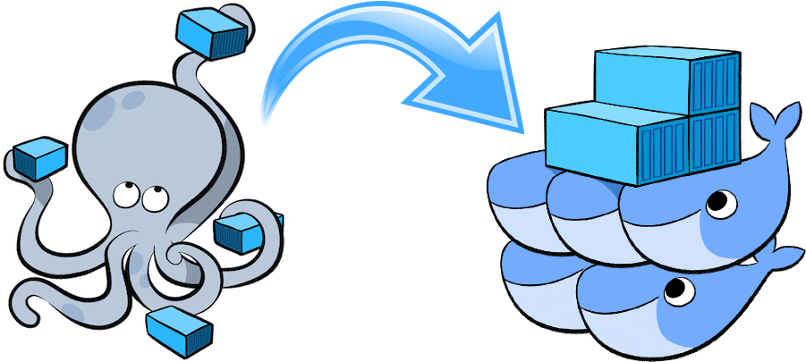

# Docker
Docker is a software platform that allows you to build, test, and deploy applications quickly. 
Docker packages software into standardized units called containers that have everything the 
software needs to run including libraries, system tools, code, and runtime. Using Docker, 
you can quickly deploy and scale applications into any environment and know your code will run.

## Commands

| Name                | Description                     | Command                              |
| ---                 | -----------                     |----                                  |
| **Build**           | Build the image                 | `docker build .`                     |
| **Run**             | Run the image on port 3000      | `docker run -p 3000:3000 8a1c26431a` |
| **List Containers** | List the running containers     | `docker ps`                          |
| **Stop Container**  | Stop container 'vigorous_dirac' | `docker stop 'vigorous_dirac`        |

