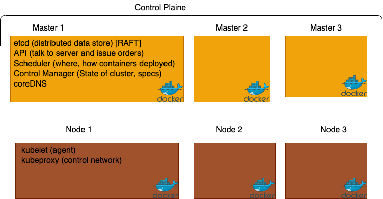

# Kubernetes

## Basic Terms: System parts

| Name                | Description                                                               |
|---------------------|---------------------------------------------------------------------------|
| Kubernetes          | The whole orhestration system                                             |
| k8s, k-eights, Kube | Name for kubernetes                                                       |
| kubectl             | CLI to configure kubernetes and manage apps, pronounced as "cube control" |
| Node                | Single server in the kubernetes cluster                                   |
| Kubelet             | Kubernetes gent running on nodes.                                         |
| Control Plane       | Set of containers hat manage the cluster                                  |

## Installs

| Name                 | Description                                     |
|----------------------|-------------------------------------------------|
| Docker Desktop       | Enable in settings                              |
| Own Linux Host or VM | MocroK8                                         |
| K8s in a Brwser      | http://play-with-k8s.com or http://katacoda.com |

## Terminology

| Name       | Description                                                                                       |
|------------|---------------------------------------------------------------------------------------------------|
| Pod        | One or More ontainers running together on one Node                                                |
|            | Basic unit of deployment, Containers are always in pods                                           |
| Controller | For creating/updating Pods and other objects                                                      |
|            | Many types of controllers inc. Deployment, ReplicaSet, StatefullSet, DeamonSet Job, CronJob, etc. |
| Service    | Network endpoint o connect to a pod                                                               |
| Namespace  | Filtered group of objects in a cluster                                                            |